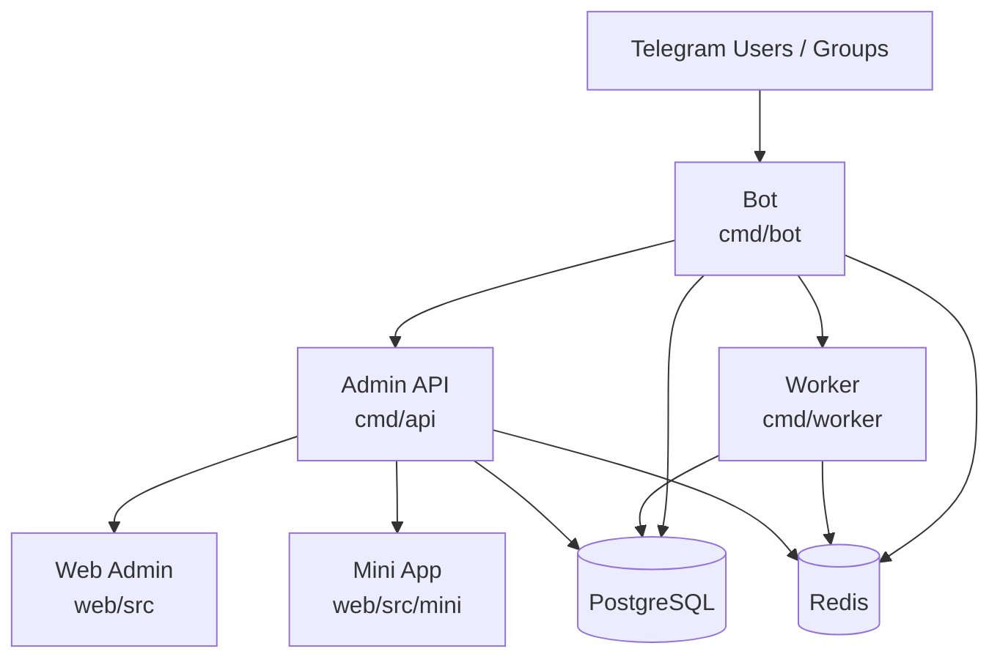

# Sola

[中文（简体）](./README.md) | English

[](./LICENSE)
[](https://go.dev/)
[](https://vuejs.org/)
[](https://core.telegram.org/bots)

Sola is an open-source Telegram group operations platform built around five independent processes: **Bot, Admin API, Web Admin Panel, Mini App, and Worker**. It is designed for teams that want to build and run a real Telegram product over the long term, not just deploy a single-purpose script bot.

## Features

| Module | Capabilities |
|--------|-------------|
| **Points** | Score by message type, cooldown anti-spam, leaderboard, history, manual adjustment, daily sign-in |
| **Moderation** | Ban/unban/mute/kick/warn, bulk delete messages, welcome messages, promote/demote admins, titles, ghost cleanup |
| **Join Verification** | 6 verification types (button / captcha / multi-choice / Poll / math / Cloudflare Turnstile Mini App) |
| **Risk Control** | Keyword filtering, link restrictions, unverified-user limits, AI spam detection (OpenAI-compatible), violation records |
| **Content Ops** | Auto-replies, message templates, invite link tracking, level system, sed inline text correction |
| **Scheduled Posts** | One-time and recurring tasks, rich media (image/video/file), Inline Keyboard, auto-delete |
| **Lottery** | Button and keyword participation, group announcements, Worker-driven auto-draw |
| **Web Admin** | Chat management, user management, points, violations, scheduled posts, lotteries, backup/restore, audit logs, system settings |
| **Mini App** | Telegram WebApp panel: dashboard, chat settings, quick publish, lottery, join verification (Turnstile) |
| **Engineering** | Docker Compose, SQL migrations, multi-tenant isolation, owner-scoped access, granular admin permissions |

## Architecture



## Tech Stack

| Layer | Technologies |
|-------|-------------|
| Backend | Go · gotgbot/v2 · Gin · GORM · gocron · JWT |
| Storage | PostgreSQL · Redis |
| Frontend | Vue 3 · Vite · Element Plus · ECharts |
| Deployment | Docker · Docker Compose · Nginx |

## Repository Layout

```text
cmd/
  api/        Admin API entry
  bot/        Telegram Bot entry
  worker/     Background Worker entry
internal/
  api/        HTTP handlers, middleware, auth
  bot/        Telegram handlers, commands, flows
  config/     Configuration loading
  model/      GORM models
  service/    Business logic
  store/      DB / Redis initialization
web/          Vue 3 admin panel
web/src/mini/ Telegram Mini App frontend
database/
  migrations/ SQL migration files (applied in filename order)
```

## Quick Start

### 1. Configure environment variables

```bash
cp .env.example .env
```

> **Note**: `config.yaml` is not required. All settings can be provided via environment variables. `config.yaml` is only used for local development; production deployments use `.env` only.

**Required:**

| Variable | Description |
|----------|-------------|
| `SOLA_BOT_TOKEN` | Telegram Bot Token (from @BotFather) |
| `SOLA_DATABASE_DSN` | PostgreSQL connection string |
| `SOLA_JWT_SECRET` | JWT secret — use a long random string |
| `SOLA_APP_ADMIN_USERNAME` | Web admin username |
| `SOLA_APP_ADMIN_PASSWORD_HASH` | bcrypt hash of the admin password (preferred over plaintext) |

Generate a password hash:

```bash
htpasswd -bnBC 12 "" your-password | tr -d ":\n"
```

**Cloudflare Turnstile (optional — required only when using the `turnstile` verification type):**

| Variable | Description |
|----------|-------------|
| `SOLA_BOT_MINI_APP_URL` | Mini App URL used to generate verification links |
| `SOLA_TURNSTILE_SITE_KEY` | From Cloudflare Dashboard → Turnstile |
| `SOLA_TURNSTILE_SECRET_KEY` | From Cloudflare Dashboard → Turnstile |
| `SOLA_TURNSTILE_VERIFY_SECRET` | HMAC signing key for join-request links — `openssl rand -base64 32` |

### 2. Start all services

```bash
docker compose up -d --build
```

Compose starts services in order: `postgres` → `redis` → `migrate` (runs pending `*.up.sql` files) → `api` / `bot` / `worker` → `nginx`.

The API is only reachable inside the Compose network by default; `nginx` handles external access. To expose the API directly for local debugging:

```bash
docker compose --profile direct-api up -d api-direct
```

### 3. Update the frontend

After editing `web/` source files, rebuild and reload nginx:

```bash
cd web && npm run build && npm run build:mini && cd ..
docker compose up -d --force-recreate nginx
```

> `build:mini` builds the Telegram Mini App (join-verification page) and merges it into `dist/` — no extra Docker volume mount needed.

### 4. Local development

```bash
# Backend (run each in a separate terminal)
go run ./cmd/api
go run ./cmd/bot
go run ./cmd/worker

# Frontend
cd web && npm install && npm run dev
```

The dev server proxies `/api` to `http://127.0.0.1:8080` automatically.

## Join Verification

Configure with `/set_verify type <type>`:

| Type | Method |
|------|--------|
| `button` | Click an "I am human" button |
| `captcha` | Enter a random numeric code |
| `multi_choice` | Custom question with multiple-choice buttons |
| `poll` | Native Telegram quiz poll |
| `math` | Random arithmetic — pick 1 of 4 answers |
| `turnstile` | Cloudflare Turnstile + Mini App: the bot sends the applicant a private WebApp link; the join request is approved automatically after they pass the challenge |

> **Turnstile prerequisites**: configure the Turnstile environment variables above and enable "Join Request Approval" in the group settings.

Additional options:
- `/set_verify difficulty easy|medium|hard` — adjust timeout and retry limits
- `/allowuser @user` — whitelist a user to skip verification
- `/verify_stats` — view today's approved / declined / timed-out counts

## Bot Command Reference

<details>
<summary>Show full command list</summary>

**Core**: `/start` `/menu` `/settings` `/help` `/info` `/bind` `/check_admin`

**Points**: `/points` `/rank` `/sign` `/points_config` `/set_points` `/set_cooldown` `/points_toggle`

**Moderation**: `/ban` `/bans` `/unban` `/mute` `/unmute` `/kick` `/warn` `/warns` `/unwarn` `/purge` `/del` `/promote` `/demote` `/set_title` `/report` `/ban_ghosts` `/violations` `/resolve_violation` `/ignore_violation`

**Verification**: `/adminconfig` `/set_welcome` `/set_warn_limit` `/verify_toggle` `/set_verify` `/verify_stats`

**Rules**: `/setrules` `/clearrules` `/rules`

**Content Ops**: `/add_keyword` `/del_keyword` `/keywords` `/add_reply` `/del_reply` `/replies` `/add_template` `/del_template` `/templates` `/invite_create` `/invite_delete` `/invites` `/set_level` `/levels` `/add_level` `/del_level`

**Posts**: `/posts` `/publish` `/post_create` `/post_toggle` `/post_delete`

**Lottery**: `/lottery`

**Stats**: `/stat` `/stat_week` `/stats`

</details>

## Security

- Admin password verified with bcrypt; login endpoint rate-limited via Redis (5 attempts per 15 minutes)
- CORS allowlist — no arbitrary origin reflection
- All chat-scoped admin endpoints enforce owner-based access checks
- Frontend session tokens are stored in memory, not `localStorage`
- Moderation actions (ban/mute/kick/keyword match) are written to `audit_logs` and queryable from the admin panel

**Before going live**: configure TLS and a domain, enable PostgreSQL/Redis persistence, and validate all core flows in a test group first.

## Database and Migrations

All schema changes are managed through `database/migrations/`; the production environment does not rely on runtime `AutoMigrate`. The `migrate` service in Docker Compose automatically applies any pending `*.up.sql` files on startup in filename order.

Without Compose, run the SQL files manually in order. When upgrading, only apply the new migration files added since the last deployment.

## Changelog

- **2026-06-17** v1.0.2 — Fix worker scheduler deadlock (self-lock when runDueJobs holds r.mu and calls increment/resetScheduledPostFailure); fix stale points in user detail panel after adjustment; fix chat_id/user_id type coercion and silent error swallowing in UsersView
- **2026-06-17** v1.0.1 — Fix worker startup blocking when initial runDueJobs Telegram API call is slow; add migration 000022 (missing verify_type column in chat_admin_configs)
- **2026-06-17** v1.0.0 — Web-based system settings page (Turnstile keys and admin password configurable from the admin panel); fix server crash when config.yaml is absent; fix bot info display; fix Mini App build and Docker volume mounts

## Contributing

Issues and pull requests are welcome.

1. Do not commit real secrets, live data, or local logs
2. Keep changes small and focused; update documentation when behavior changes
3. Include paired `*.up.sql` / `*.down.sql` migration files for any schema changes

## License

MIT · See [LICENSE](./LICENSE)
